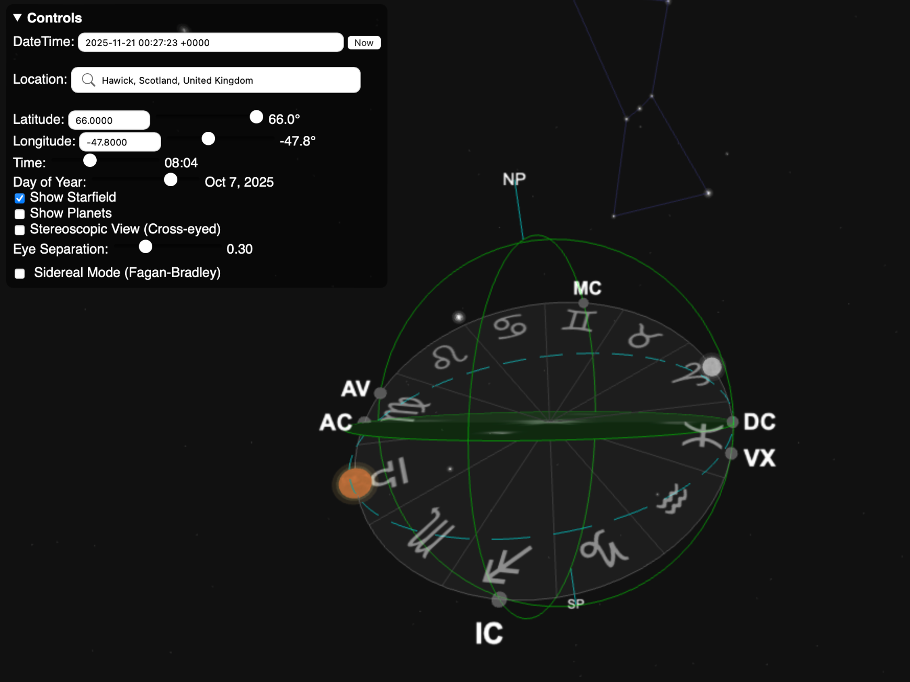
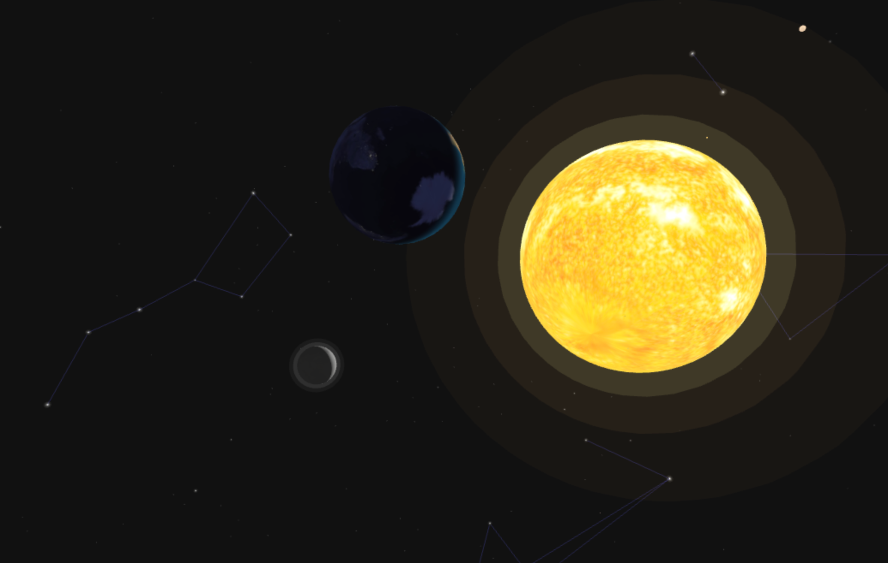
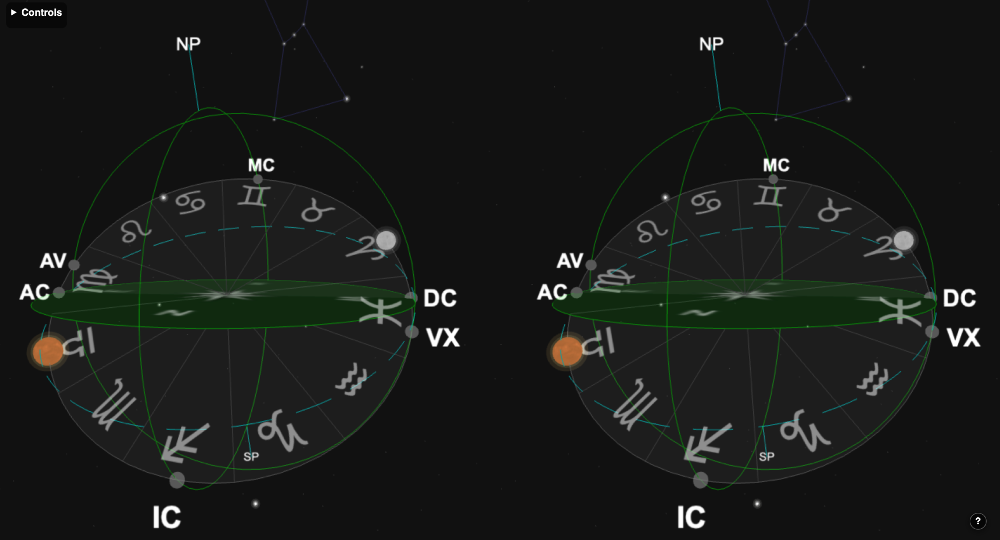

# Armillary Sphere

> An interactive 3D visualization of the celestial sphere with real-time astronomical calculations and astrological angle display.

[](LICENSE)
[](https://threejs.org/)




## Overview

The Armillary Sphere is a browser-based astronomical visualization tool that recreates the ancient armillary sphere instrument in an interactive 3D environment. It provides accurate astronomical calculations and displays key astrological angles including the Ascendant, Midheaven, and Local Sidereal Time for any location, date, and time on Earth.

## Key Features

### 🌌 Interactive 3D Celestial Sphere
- Celestial equator and ecliptic plane with zodiac wheel
- Horizon, meridian, and prime vertical reference planes
- Realistic starfield with constellation lines
- Interactive camera controls (rotate, zoom, pan)
- **Stereoscopic 3D mode** - View in true 3D using cross-eye viewing technique


*Screenshot placeholder: Celestial equator, ecliptic, and reference planes*

### 📐 Astrological Calculations
- **Midheaven (MC)** and Imum Coeli (IC) - The meridian cusps
- **Ascendant (ASC)** and Descendant (DSC)** - The horizon cusps
- **Local Sidereal Time (LST)** - Real-time sidereal calculations
- Zodiac notation display (degrees, signs, minutes)

### ☀️ Astronomical Phenomena
- Real-time planetary positions using high-precision ephemeris
- Support for any year (historical and future)
- Precise obliquity calculations for accurate coordinate transformations



> **Note:** Planetary sizes and distances are not drawn to scale. The visualization prioritizes clarity and educational value over physical accuracy of celestial body sizes.

### ⏰ Flexible Date & Time Input
- **Natural language parsing** - Type "now", "March 21 2000 noon", "tomorrow"
- **Custom formats** - Support for MMDDYYYYHHMM and ISO formats
- **Interactive sliders** - Fine-tune time, day, and year
- **Timezone awareness** - Automatic timezone detection with location selection

### 🌍 Location Controls
- Geographic location search with autocomplete
- Manual latitude/longitude input
- Timezone-aware calculations
- Support for both hemispheres with proper orientation

## Getting Started

### Prerequisites
- Node.js (v16 or higher)
- npm or yarn

### Installation

1. **Clone the repository**
   ```bash
   git clone https://github.com/yourusername/armillary-sphere.git
   cd armillary-sphere
   ```

2. **Install dependencies**
   ```bash
   npm install
   ```

3. **Set up environment variables** (optional, for timezone lookups)

   Create a `.env` file in the project root:
   ```
   VITE_GEOAPIFY_API_KEY=your_api_key_here
   ```

   > **Note:** The app works without an API key, but timezone detection requires a Geoapify API key. Get one free at [geoapify.com](https://www.geoapify.com/).

4. **Start the development server**
   ```bash
   npm run dev
   ```

   The application will open automatically at `http://localhost:8080`

### Building for Production

```bash
npm run build
```

The production build will be output to the `dist/` directory.

```bash
npm run preview
```

Preview the production build locally before deployment.

## Usage Guide

### Navigating the 3D View

| Action | Control |
|--------|---------|
| Rotate view | Left-click and drag |
| Zoom in/out | Mouse wheel or pinch gesture |
| Pan camera | Right-click and drag (or two-finger drag) |
| Zoom to planet | Double-click on a planet |
| Planet context menu | Right-click on a planet |
| Toggle stereoscopic mode | Press **S** key |
| Start/stop time animation | Press **Spacebar** |
| Adjust animation speed | Press **[** to decrease or **]** to increase (when animating) |
| Jump time forward/backward | Press **]** or **[** (when not animating, hold for acceleration) |

**Interacting with Celestial Bodies:**
- **Double-click** any planet, the sun, or moon to smoothly zoom the camera to that object
- **Right-click** on a celestial body to open a context menu with zoom options for all visible planets
- **Hover** over bright stars to see their name and constellation

**Stereoscopic 3D Viewing:**
When stereoscopic mode is enabled, the view splits into two side-by-side images. To view in 3D:
1. Press the **S** key to enable stereoscopic mode
2. Use the **cross-eye viewing technique**: cross your eyes until the two images merge into one
3. Once merged, you'll see the celestial sphere in true stereoscopic 3D depth
4. Press **S** again to return to normal view



### Time Animation

The armillary sphere includes a powerful time animation system that lets you watch celestial movements in real-time:

**Starting/Stopping Animation:**
- Press **Spacebar** to start or pause time animation
- When animating, time progresses automatically at a configurable speed
- Animation state is displayed in the upper-right corner

**Speed Control:**
- Press **]** (right bracket) to double the animation speed
- Press **[** (left bracket) to halve the animation speed
- Speed ranges from 30 minutes/second to 1 year/second
- Speed indicator shows current rate (e.g., "1.0 hours/sec", "2.5 days/sec")

**Manual Time Control:**
- When animation is paused, press **]** to jump forward 48 minutes
- Press **[** to jump backward 48 minutes
- Hold the key for accelerating jumps (2x, 4x, 8x, 16x, up to 32x speed)

This feature is ideal for:
- Observing planetary motion over days or months
- Watching the sun's path through the zodiac
- Tracking the progression of astrological angles
- Educational demonstrations of celestial mechanics

### Setting Date and Time

**Using Natural Language:**
Type in the date/time input field:
- `now` - Current date and time
- `March 21 2000 noon` - Vernal equinox at noon
- `2000-03-21 12:00` - ISO format
- `12252000noon` - Custom format (MMDDYYYYHHMM)

**Using Sliders:**
- **Time slider**: Adjust hour and minute (00:00 - 23:59)
- **Day slider**: Change day of year (1-365/366)
- **Year input**: Enter any year for historical or future dates

**Quick Actions:**
- Click **"Now"** button to jump to current date/time

### Setting Location

**Using Location Search:**
1. Click on the location input field
2. Type a city name or address
3. Select from autocomplete suggestions
4. Latitude, longitude, and timezone are set automatically

**Manual Input:**
- Use latitude slider (-90° to +90°) or type value
- Use longitude slider (-180° to +180°) or type value
- Press Enter after typing to apply

## Technical Architecture

### Built With

- **[Three.js](https://threejs.org/)** (v0.181.1) - 3D rendering engine
- **[Ephemeris](https://github.com/0xStarcat/Moshier-Ephemeris-JS)** (v2.2.0) - High-precision astronomical calculations
- **[chrono-node](https://github.com/wanasit/chrono)** (v2.9.0) - Natural language date/time parsing
- **[Luxon](https://moment.github.io/luxon/)** (v3.7.2) - Timezone-aware date handling
- **[Vite](https://vitejs.dev/)** - Build tool and dev server

### Coordinate Systems

The visualization uses multiple nested coordinate systems:

1. **Horizon System** - Fixed to observer (horizon at y=0, zenith at +y)
2. **Celestial Equatorial System** - Rotates with Local Sidereal Time, tilted by latitude
3. **Ecliptic System** - Tilted from equator by obliquity of the ecliptic (~23.4°)

Objects are positioned in their natural coordinate system and automatically transformed through the hierarchy.

### Astronomical Accuracy

- Julian Date calculations for precise time representation
- Precise obliquity calculations using polynomial approximations
- High-precision ephemeris for planetary positions
- Support for any year with proper leap year handling

## Browser Support

Works in all modern browsers with WebGL support:
- Chrome/Edge 90+
- Firefox 88+
- Safari 14+

## Contributing

Contributions are welcome! Please feel free to submit issues or pull requests.

### Development Setup

See [Getting Started](#getting-started) for initial setup, then:

1. Create a feature branch
2. Make your changes
3. Test thoroughly across different dates, times, and locations
4. Submit a pull request

## License

This project is provided as-is for educational and astronomical purposes.

## Acknowledgments

- Celestial texture maps from [Planet Pixel Emporium](https://planetpixelemporium.com/)
- Astronomical algorithms based on Jean Meeus's "Astronomical Algorithms"
- Ephemeris calculations powered by Moshier Ephemeris
- Geocoding by [Nominatim](https://nominatim.org/)
- Timezone data from [Geoapify](https://www.geoapify.com/)

## Support

If you encounter any issues or have questions:
- Open an issue on GitHub
- Check existing issues for solutions
- Review the [CLAUDE.md](CLAUDE.md) file for technical details

---

**Made with ☀️ and ⭐ for astronomy and astrology enthusiasts**
